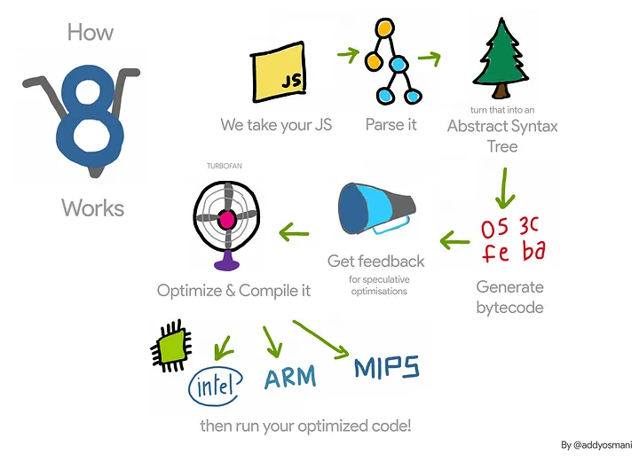

# Network Performance

- depends on network connection
- bigger the app, more network requests
- shows priority

## Waterfall

- Queueing (Grey)

  > High priority requests

  > Too many requests

  > Browser get stuck

- Green and Orange

  > Stuffs being set up on service side

  > Resolving an IP address

- Green (Waiting)

  > data is gotten into server and coming out finally

  > the first byte of data

- Content Download (Blue)

  > Browser is recieving a response from the server

  > Depends on network speed

  > Method to make the content smaller

<br>

- **When having total 6 items, the lowest priority gets fetched at the same time as the highest priority**
- **When more than 6 items, the lower priority items spend more time in queueing**

## HOW V8 WORKS



> Parsing
>
> > analyzing and converting a program into an internal format that a runtime environment can actually run

> Abstract syntax tree
>
> > Convert in DOM tree

## What slows our web apps from booting up?

- Parsing, Compiling and Executing scripts are things a JavaScript engine spends significant time in during start-up.
- Depends on how soon the user interacts with the website

## Measuring Real user performance

- console.time()

  ```
  - we console time which keeps the track of the time
  - prints a more accurate and finite time
  ```

- Performance API

  > performance mark and measure!

      performance.mark("Start");
      for (let i = 0; i < 1000000000; i++) {
      // Do nothing
      }
      performance.mark("End");
      performance.measure("Frontend Masters Chrome Devtools", "Start", "End");
      performance.getEntriesByType("measure");

  > performance.getEntriesByType("resource"); - shows all the resources

  > performance.getEntriesByType("paint") - searches for type paint

  > performance.getEntriesByType("navigation");
